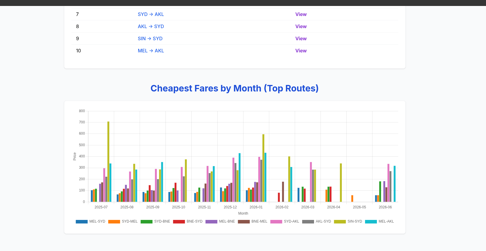

# Flight Insights

## Setup Instructions

To run Flight Insights locally, follow these steps:

1. **Clone the repository:**
   ```bash
   git clone https://github.com/Soumyadip-gole/flight-insights.git
   cd flight-insights
   ```

2. **Install dependencies:**
   ```bash
   pip install -r requirements.txt
   ```

3. **Set up environment variables:**

   Create a `.env` file in the project root and add the following keys:

   ```env
   # Required for flight data and analytics
   TRAVELPAYOUTS_API_TOKEN=your_travelpayouts_api_token_here

   # Required for AI-powered insights (Gemini/Google AI)
   GEMINI_API_KEY=your_gemini_api_key_here
   ```

   - Replace `your_travelpayouts_api_token_here` with your actual Travelpayouts API token.
   - Replace `your_gemini_api_key_here` with your actual Gemini API key.
   - **Both keys are mandatory** for full functionality (flight analytics and AI insights).

   If you do not have these credentials, please sign up at [Travelpayouts](https://www.travelpayouts.com/) and [Google AI/Gemini](https://ai.google.dev/) to retrieve your API tokens.

5. **Run the application:**
   ```bash
   python app.py
   ```
   - The app will typically start on `http://localhost:5000` or the port configured in your environment.

6. **Access in your browser:**
   - Navigate to `http://localhost:5000` to use Flight Insights locally.

---

## Screenshots

Below are sample screenshots from the application (located in the `assets` directory):





---

## Table of Contents

- [Features](#features)
- [Project Structure](#project-structure)
- [Usage Guide](#usage-guide)
- [Main Pages and Components](#main-pages-and-components)
- [API Endpoints](#api-endpoints)
- [AI-Powered Insights](#ai-powered-insights)
- [Data Visualization](#data-visualization)
- [Contributing](#contributing)

---

## Features

- **Popular Route Analytics**: Visualizes the most frequently searched or traveled air routes.
- **Monthly Fares Comparison**: Displays fare trends for top routes over different months.
- **Route Details & Breakdown**: Analyzes individual routes, providing details like pricing volatility, flight breakdown (direct vs connecting), and monthly price comparison.
- **AI Travel Insights**: Generates route summaries, price predictions, booking tips, and travel recommendations using AI.
- **Interactive Charts & Tables**: Utilizes dynamic charts for price trends and tables for monthly comparisons.

---

## Project Structure

The application is organized into the following main directories:

```
flight-insights/
│
├── templates/
│   ├── index.html             # Home page: Popular routes, fare trends
│   ├── route_details.html     # Detailed analytics for a selected route
│   ├── route_search.html      # Search interface for custom route selection
│
├── static/
│   ├── js/                    # Frontend JavaScript logic
│   ├── css/                   # Stylesheets
│
├── app.py / main.py           # Backend entrypoint (Flask/FastAPI or similar)
├── README.md                  # Project documentation
└── ...                        # Other configuration and code files
```

Key template files:
- `index.html`: Landing page showing popular routes and multi-route monthly fare comparisons.
- `route_details.html`: Displays detailed analysis for a single route, including AI insights and breakdowns.
- `route_search.html`: Lets users select start/end dates and search for specific flight routes.

---

## Usage Guide

1. **Landing Page (`index.html`)**:
   - Search for flight routes by selecting origin, destination, start date, and end date.
   - View a table of the most popular routes.
   - Explore monthly fare trends for the top 10 routes in a comparative chart.

2. **Route Details (`route_details.html`)**:
   - After selecting a route, view detailed analysis: total flights analyzed, price volatility, best/worst travel months, direct/connecting flight breakdown, and more.
   - Interactive price fluctuation chart and monthly comparison table.
   - AI-generated insights and recommendations.

3. **Route Search (`route_search.html`)**:
   - Custom route selection with AI-powered travel summaries, fare predictions, and booking tips.

---

## Main Pages and Components

### `index.html`
- **Search Form**: Select origin, destination, dates, and trigger search.
- **Popular Routes Table**: Shows top 10 routes with quick access.
- **Monthly Fares Chart**: Compares prices for multiple top routes.

### `route_details.html`
- **Key Metrics Cards**: Overview of total flights, average price, price range, volatility, best/worst months.
- **AI Insights Section**: Summaries, predictions, tips, recommendations, and airline performance.
- **Price Fluctuation Chart**: Visualizes monthly price changes and trend lines.
- **Flight Breakdown**: Shows direct vs connecting flights, their counts and percentages.
- **Monthly Price Comparison Table**: Lists average prices, trends, and recommendations for each month.

### `route_search.html`
- Similar analytics as route details, tailored for custom user-selected searches.

---

## API Endpoints

The application interfaces with backend APIs to fetch analytics data. Example endpoints include:

- `/api/monthly/<origin>/<destination>`: Gets monthly average fare data for a route.
- `/api/route/<origin>/<destination>`: Fetches detailed analytics for a specific route.
- Additional endpoints for search, insights, and statistics.

---

## AI-Powered Insights

- **Route Summary**: High-level analysis of route patterns and pricing.
- **Price Prediction**: Forecasts future price trends based on historical data.
- **Booking Tips**: AI-generated recommendations to save money on tickets.
- **Travel Recommendations**: Advice for flexible travel planning and best months to fly.
- **Airline Performance**: Evaluates service quality and reliability.

---

## Data Visualization

- **Charts**: Utilizes Chart.js for interactive bar and line charts.
- **Tables**: Responsive tables for route and monthly data.
- **Color-coded Metrics**: Highlights best/worst months, direct/connecting flight percentages, and price ranges.

---

## Contributing

Contributions are welcome! To propose a change:
1. Fork the repository and clone it.
2. Create a new branch for your feature or bugfix.
3. Submit a pull request with a clear summary of your changes.

---
